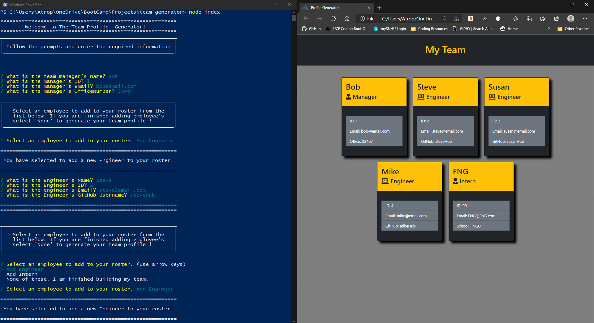

# Team Profile Generator  
[](https://opensource.org/licenses/MIT)  

# Screenshot


# Description
Team Profile Generator is a Node.js application that dynamically generates an HTML porfolio that contains email and gitHub information for team members.

# Table of Contents
*[Demo](#demo)  
*[Technology](#technology)  
*[Features](#features)  
*[Installation](#installation)  
*[Usage](#usage)  
*[Contribute](#contribute)  
*[Tests](#tests)  
*[Questions](#questions)  
*[License](#license)

# Demo
[DEMO: Team Profile Generator](https://drive.google.com/file/d/1IAt_96EQxS67WplW8dt5P4T0NnFw8-we/view)

# Technology 
| Technology | Description                        |Links ↘️ |
| ---------- | -----------------------------------| ------|  
|  | ES6+ | [Jest](https://jestjs.io/) |
|  | Hyper Text Markup Language | [Font Awesome](https://fontawesome.com/) |
|  | Cascading Style Sheets  | [Bootstrap](https://getbootstrap.com/) |

# Features
This app features the Inquirer package for user prompts and jest for TDD.

# Installation  
Project Repository: [Team Profile Generator](https://github.com/iiTONELOC/team-generator)  
Clone the repo, the link is above. Navigate to the root of the directory of the project.   Then type the following command to load the required modules: ```npm install```  Once the modules have finished loading type: ```node index``` 

# Usage
[Team Profile Generator](https://github.com/iitoneloc/team-generator)  
Follow the prompts and enter in the information. You can add as many or as little team members as necessary. 

# Contribute 
If you wish to contribute, fork the repo and issue a pull request for changes.

# Tests
Tests are built in, if you wish to run the tests in the modules from the root of the directory type: ```npm run test```   If you wish you add your own tests be sure to include them in the __tests__ folder.

# Questions
Feel free to reach out if you have any questions

Contact via GitHub: [iiTONELOC](https://github.com/iiTONELOC)  
Send an email: [anthonytropeano@me.com](mailto:anthonytropeano@me.com)

# License
MIT License

        Copyright (c) 2021 Anthony Tropeano
        
        Permission is hereby granted, free of charge, to any person obtaining a copy
        of this software and associated documentation files (the "Software"), to deal
        in the Software without restriction, including without limitation the rights
        to use, copy, modify, merge, publish, distribute, sublicense, and/or sell
        copies of the Software, and to permit persons to whom the Software is
        furnished to do so, subject to the following conditions:
        
        The above copyright notice and this permission notice shall be included in all
        copies or substantial portions of the Software.
        
        THE SOFTWARE IS PROVIDED "AS IS", WITHOUT WARRANTY OF ANY KIND, EXPRESS OR
        IMPLIED, INCLUDING BUT NOT LIMITED TO THE WARRANTIES OF MERCHANTABILITY,
        FITNESS FOR A PARTICULAR PURPOSE AND NONINFRINGEMENT. IN NO EVENT SHALL THE
        AUTHORS OR COPYRIGHT HOLDERS BE LIABLE FOR ANY CLAIM, DAMAGES OR OTHER
        LIABILITY, WHETHER IN AN ACTION OF CONTRACT, TORT OR OTHERWISE, ARISING FROM,
        OUT OF OR IN CONNECTION WITH THE SOFTWARE OR THE USE OR OTHER DEALINGS IN THE
        SOFTWARE.
        
